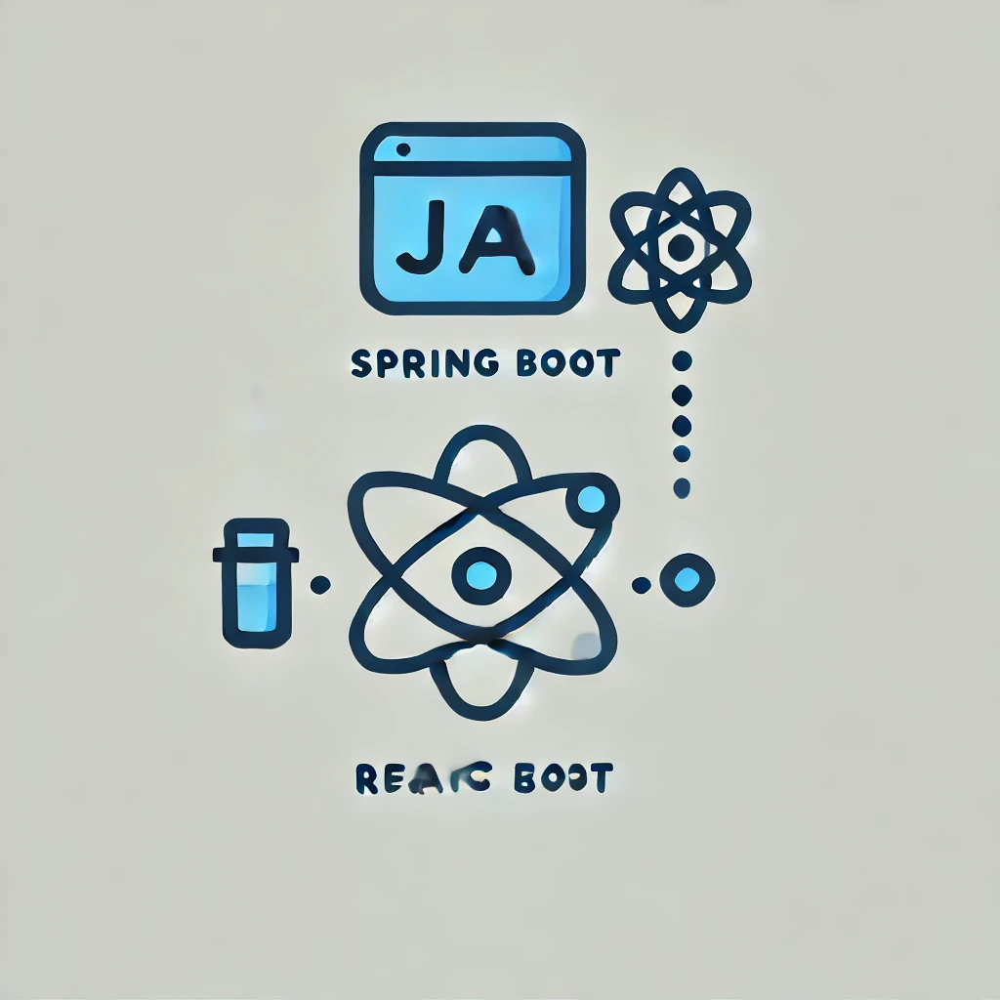

# QA-Local-Testing-Env



Este repositorio contiene todo lo necesario para levantar los servidores del backend y frontend en tu entorno local para realizar pruebas tempranas de QA. Con esta guía, podrás configurar el entorno de desarrollo y empezar a realizar pruebas de manera autónoma.

## Tabla de Contenidos
- [Requisitos](#requisitos)
- [Configuración del Backend](#configuración-del-backend)
- [Configuración del Frontend](#configuración-del-frontend)
- [Comandos Útiles](#comandos-útiles)
- [Solución de Problemas](#solución-de-problemas)
- [Inicia tu primer proyecto Vite](#inicia-tu-primer-proyecto-vite)
- [Enlaces de Interés](#enlaces-de-interés)

## Requisitos

Antes de comenzar, asegúrate de tener instaladas las siguientes herramientas:

- [Java JDK](https://www.oracle.com/java/technologies/javase-jdk11-downloads.html) - Versión 21 o superior.
- [Maven](https://maven.apache.org/) - Para manejar las dependencias del backend.
- [Node.js](https://nodejs.org/en) - Versión 18.x o superior.
- [npm](https://www.npmjs.com/) o [yarn](https://yarnpkg.com/) - Para manejar las dependencias del frontend.
- [MySQL](https://dev.mysql.com/downloads/installer/) - Para la base de datos.
- [Git](https://git-scm.com/) - Para clonar el repositorio.
- [Vite](https://vitejs.dev/guide/) - Para levantar el servidor de desarrollo del frontend.
- [IntelliJ IDEA Community Edition](https://www.jetbrains.com/idea/download/?section=windows) - IDE recomendado para trabajar con Spring Boot.
- [Visual Studio Code](https://code.visualstudio.com/) - IDE recomendado para trabajar con React.

## Recomendación del IDE

Para trabajar con Spring Boot, **IntelliJ IDEA Community Edition** es altamente recomendado. Este IDE ofrece varias ventajas que facilitan el desarrollo, especialmente para quienes no tienen experiencia avanzada en configuración de entornos:

- **Integración Completa con Java**: IntelliJ IDEA Community Edition viene con soporte integrado para Java, lo que simplifica el desarrollo y evita la necesidad de configurar manualmente el entorno Java.
- **Configuración Automática de Maven**: El IDE gestiona automáticamente las dependencias y el path de Maven, facilitando la construcción y ejecución del proyecto sin complicaciones adicionales.
- **Facilidad de Uso**: La configuración automática y las recomendaciones del IDE son especialmente útiles para aquellos que pueden no estar familiarizados con todas las configuraciones y comandos necesarios para levantar un proyecto Spring Boot.

## Configuración del Backend

1. Clona el repositorio y navega a la carpeta del backend:

    ```bash
    git clone https://github.com/DVTecno/QA-Local-Testing-Env.git
    cd backend
    ```

2. Compila el proyecto y descarga las dependencias:

    ```bash
    mvn clean install
    ```

3. Configura las variables de entorno:

   - Crea un archivo `application.properties` en `src/main/resources/` con el siguiente contenido:

     ```properties
     spring.datasource.url=jdbc:mysql://localhost:3306/tu_base_de_datos
     spring.datasource.username=tu_usuario
     spring.datasource.password=tu_contraseña
     ```

4. Levanta el servidor:

    ```bash
    mvn spring-boot:run
    ```

    El backend estará corriendo en `http://localhost:8080`.

## Configuración del Frontend

1. Navega a la carpeta del frontend:

    ```bash
    cd frontend
    ```

2. Instala las dependencias:

    ```bash
    npm install
    ```

3. Levanta el servidor de desarrollo:

    ```bash
    npm run dev
    ```

    El frontend estará corriendo en `http://localhost:5200`.

## Comandos Útiles

- **Iniciar el Backend**: `mvn spring-boot:run` (en la carpeta `backend`)
- **Iniciar el Frontend**: `npm run dev` (en la carpeta `frontend`)
- **Construir el Frontend para Producción**: `npm run build`

## Verificación de la Configuración

Para asegurarte de que todo se ha configurado correctamente:

1. **Backend**: Visita `http://localhost:8080` en tu navegador. Deberías ver la página de bienvenida o un mensaje indicando que el servidor está corriendo.
2. **Frontend**: Visita `http://localhost:5200` en tu navegador. Deberías ver la interfaz de la aplicación cargada correctamente.
3. **Base de Datos**: Usa MySQL Workbench para conectarte a la base de datos en `localhost:3306` y verificar que la base de datos `tu_base_de_datos` existe y es accesible.

## Solución de Problemas

- **Problema 1**: No se puede conectar a la base de datos.
  - **Causa posible**: MySQL no está corriendo o las credenciales son incorrectas.
  - **Solución**:
    1. Verifica que MySQL esté en ejecución. En Linux, usa el comando `sudo systemctl status mysql`. En Windows, usa `sc query mysql`.
    2. Asegúrate de que las credenciales en `application.properties` sean correctas. Intenta conectarte a la base de datos manualmente usando MySQL Workbench para verificar la conectividad.

- **Problema 2**: El frontend no carga.
  - **Causa posible**: El backend no está corriendo o hay un problema con el puerto.
  - **Solución**:
    1. Asegúrate de que el backend esté corriendo en `http://localhost:8080`.
    2. Verifica que el servidor de desarrollo del frontend esté en `http://localhost:5200`.
    3. Revisa la configuración del archivo `.env` en el frontend y asegúrate de que `VITE_API_URL` esté configurado correctamente.


## Inicia tu primer proyecto Vite

### Nota de compatibilidad

Vite requiere Node.js versión 18+ o 20+. Sin embargo, algunas plantillas requieren una versión superior de Node.js para funcionar, por favor actualiza si tu gestor de paquetes te advierte sobre ello.

### Crear un Proyecto con Vite

Para crear un nuevo proyecto de React usando Vite, sigue estos pasos:

1. Abre tu terminal y ejecuta el siguiente comando:

    ```bash
    npm create vite@latest
    ```

2. Sigue las instrucciones que aparecen en la terminal para configurar el proyecto.

Durante la configuración, se te solicitarán las siguientes opciones. Debes seleccionar las siguientes:

Selecciona un framework:

En la terminal, elige React de la lista de opciones:

```bash
? Select a framework:
    Vanilla
    Vue
    React <-
    Preact
    Lit
    Svelte
```

Luego, elige entre JavaScript o TypeScript:

```bash
? Select a variant:
    JavaScript <-
    TypeScript
```

3. Una vez configurado, navega a la carpeta del proyecto y levanta el servidor de desarrollo:

    ```bash
    cd nombre-del-proyecto
    npm install
    npm run dev
    ```

El proyecto estará corriendo en `http://localhost:5200`.


## Preguntas Frecuentes

**1. ¿Qué hago si mi puerto 8080 ya está en uso?**

Puedes cambiar el puerto del backend editando el archivo
 `application.properties`:
```bash
server.port=8081
```

## ¡Todo Listo!

Ahora que tienes todo configurado, puedes empezar a realizar tus pruebas en el entorno local. Si encuentras algún problema, revisa la sección de solución de problemas o consulta los enlaces de interés para obtener más ayuda.

## Enlaces de Interés

- **Instalador MySQL Community y MySQL Workbench**:  
  [MySQL Community](https://dev.mysql.com/downloads/installer/)  
  [MySQL Workbench](https://dev.mysql.com/downloads/workbench/)

- **Instalador Node.js**:  
  [Node.js](https://nodejs.org/en)

- **Instalador Vite**:  
  [Vite](https://es.vitejs.dev/guide/)

- **Instalar IntelliJ IDEA Community Edition**:  
  [IntelliJ IDEA](https://www.jetbrains.com/idea/download/?section=windows)

- **Instalar Visual Studio Code**:  
  [Visual Studio Code](https://code.visualstudio.com/)
